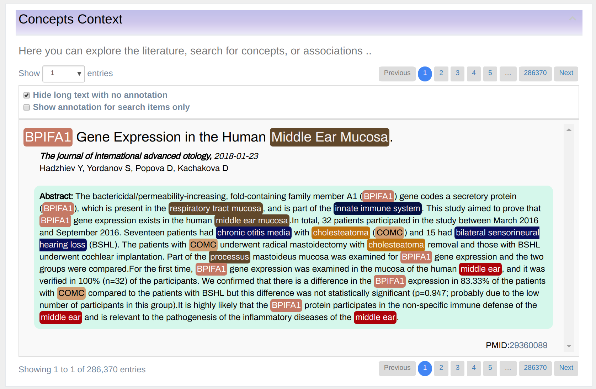
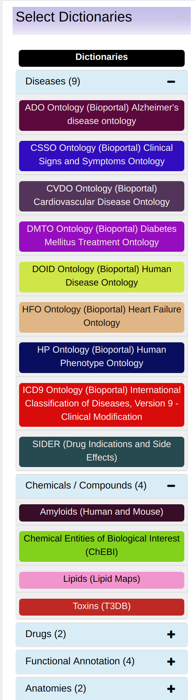
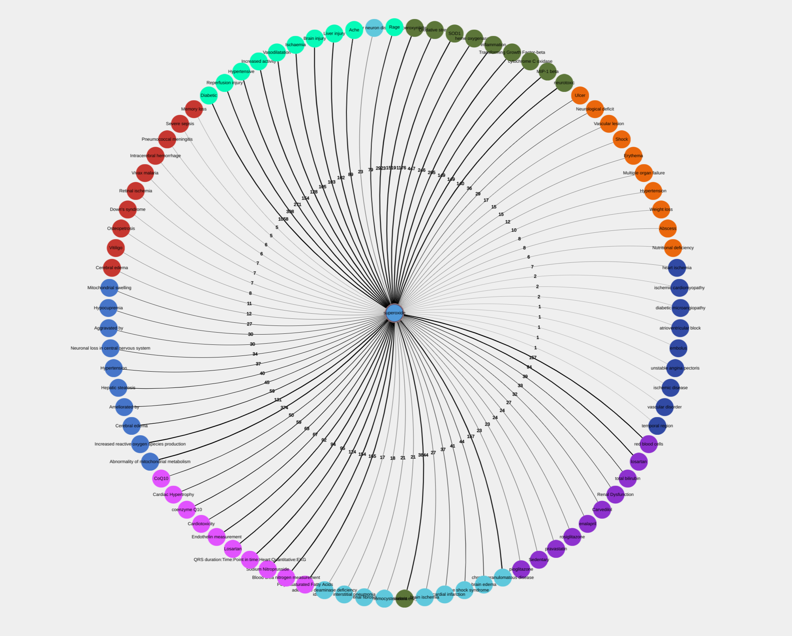
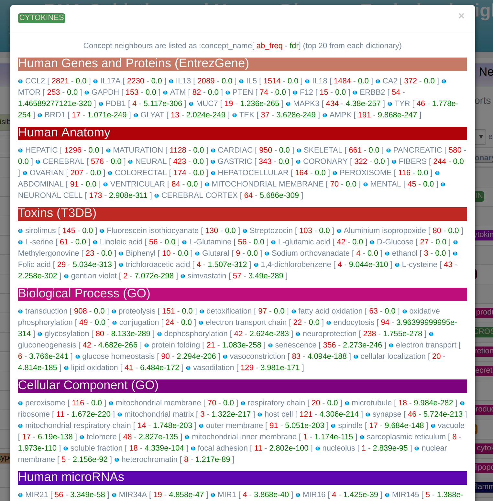
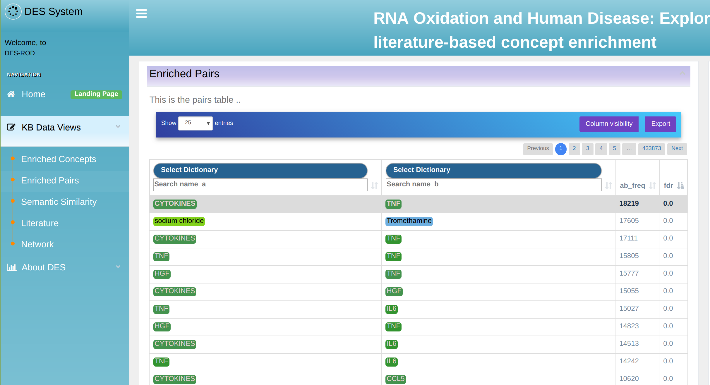
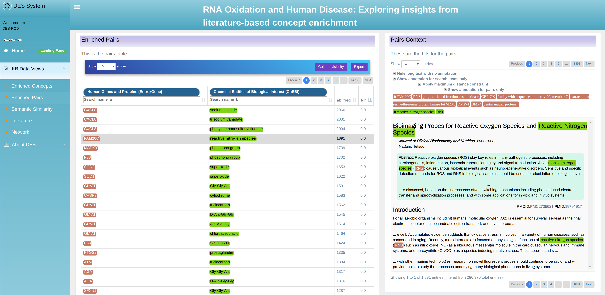

# Knowledgebase exploration in DES-RV
## Introduction

Examples were extracted from the DES-rv KB, minor differences might exist
for the other KBs build on DES.

Central to the knowledgebase is a notion of a “term” or
“concept”. A term is a biological name or a phrase (e.g. Crohn’s
diseases, autopphagy, T300A, etc.) used to mine the literature as
illustrated in Figure 2. More detailed information about
dictionaries can be found on the page "Dictionaries". Terms are organized into
thematic dictionaries as shown in Figure 3.  A term can be enriched
by other data. Information sources like scientific papers and
bioinformatics’ databases are analyzed, relevant terms extracted and
recorded in the knowledgebase. In addition, connections between
terms/concepts (in the knowledgebase called the “Enriched
Pairs”) are inferred based on their co-occurrence. For example,
terms “*Crohn’s diseases*” and “*T300A*” if mentioned in the same paper in
a close proximity are co-occurring. Also, the knowledgebase system can
infer hypotheticals. These hypotheses can be used as a starting point
for possible further investigations.  As a knowledgebase user, you
will deal with terms: you can search the literature using them as
keywords, you can list them, rank according to their relevance, find
hidden relationships between them or ask the system to create
hypotheses.

## Knowledgebase Exploration

DES_rv is a web based application. To start exploring, inside your
browser open the [home
page](https://www.cbrc.kaust.edu.sa/des-rv). This will take you to the
knowledgebase opening screen as shown in Figure 4 for
*DES-rv*. To navigate through the knowledgebase, you can use the
main menu as shown in the figure 5.

## Knowledgebase navigation and exploration modes

You can easily navigate through the knowledgebase by using the main menu
as shown in Figure 5. After clicking on any of the options it will
become highlighted and an appropriate exploration mode will open. The
knowledgebase exploration modes are:

- Home: takes user to the knowledgebase home page.
- Enriched Concepts: shows list of terms enriched with information from various databases.
- Enriched Pairs: shows terms linked across multiple documents.
- Semantic Similarity: Explore semantically related concepts.
- Literature: enable literature exploration by using terms and dictionaries as
keywords.
- Network: explore concepts through network interface.
- About DES: shows background information about the knowledgebase.

## Enriched Concepts exploration mode

In this mode, you can explore terms occurring in the knowledgebase as
shown in Figure 6. The terms are displayed in a table that can be
sorted by any of the column by simply clicking on the column
heading. Also, users can filter the list by any column by typing a
keyword, or part of a keyword in the boxes above the table
heading.

The following columns are available:

- FDR: False Discovery Rate shows rate of terms false
detection. The p-values in this column are corrected using the
Bonferroni-Hochberg method for multiplicity testing (FDR).
- KB Freq: knowledgebase frequency shows the count of all name variations of the
term within this knowledgebase. By clicking on the frequency number a new window
will open showing the literature in which a term has been found.
- PubMed Freq: The total count of all name variations of the terms
within PubMed and PubMed Central.
- Dictionary: allows filtering
terms by a dictionary.

Right-click on a term’s name opens a
visualization menu associated with the concept as shown in Figure 6.
The menu has two options:

* Network: shows an interconnection
 graph between various terms.
* Term Co-occurrence: shows
 co-occurrences table i.e. list of other concepts that occur in the
 literature together with the selected one.

Here we explain the options in more details.

### Network option

This option opens a visualization window as shown in Figure 7 showing an
interconnection graph for top 50 terms. Each term on the graph is
presented as a network node liked to another node via line labeled
with a number of documents supporting the link. The graph can be
explored in multiple ways, which we explain later.

### Term Co-occurrence

Displays associated terms categorized by Dictionary as shown in Figure 8. This is a useful and
informative functionality, as the user can see the top 50 associated
terms with the selected one (after p_value cut-off), organized by
dictionaries. The lists can be filtered in order of frequency (raw
co-occurrence counts), p-value, or PMI (Point-wise Mutual Information
measure). These enriched associations are cut-off at 0.05 after the
Bonferoni correction for FDR. The user can further restrict this
threshold using the P_VALUE MAX input.

### Enriched Term Pairs exploration mode

This exploration mode allows users to explore terms linked across
multiple documents. In the simplest form, it is a simple co-occurrence
of two terms in the same document. However, the information provided
is much richer and displayed as a table as shown in Figure 9.

The table displays term pairs marked as *A* and *B*. Information about term association is organized in
the following columns:

- FDR: False Discovery Rate. The values
represent how enriched the co-occurrence of the two term is, as the
probability of them co-occurring as much by chance. The p-values in
this column are corrected for multiplicity testing using
Boneferroni-Hochberg (FDR).
- PMI: Point-Wise Mutual Information is
another measure for the strength of association of two terms based on
their individual occurrence, as well as simultaneous co-occurrence
within the knowledgebase.
- A Freq: term A frequency. A total count
of term A name variations occurrence within the knowledgebase.
- B Freq: term B frequency. A total count of term B name variations
occurrence within the knowledgebase.
- AB Freq: total number of
documents within literature database where any name variation of term
A co-occurs with any name variation of term B. Co-occurrence is
counted at the level of title, abstract, and sentences.
- First and second dictionary selection: allows filtering terms A and B by a
dictionary. Associations can be limited to one dictionary, or to a
dictionary versus another, by using the 'First Dictionary' or/and
'Second Dictionary' drop-down menus.

The table can be ordered by any of its columns, and cut-offs can be
applied to any of its numerical columns at the table header or
footer. Terms are also searchable from the Filter input in the
header. Also, individual dictionaries can be searchable at the table
header/footer text inputs.  Associations are first captured through
raw co-occurrence counts, and then two more accurate measures are used
to rank the strength of these associations. The Point-wise Mutual
Information measure is a well-known metric for quantifying association
in information theory and statistics:

In the above, p(x) can be thought of as the frequency of the first
term (A Count column), p(y) the frequency of the second term (B Count
column), and p(x,y) as the co-occurrence frequency (AB Count
column). The actual values range between -1 (weakest associations) to
+1 (strongest).

The associations are also ranked by the probability P((X,Y)>=AB Count
| X=A Count, Y=B Count) where A and B are drawn from the constant
number of articles within knowledge-base. This is calculated to be the
hypergeometric p-value for enriching the less frequent concept against
the more frequent one. From our observations, this seems to be a
robust measure for quantifying relevant associations. The table of
associations is ordered by this p-value by default. The p-value is
corrected for false discovery rate using Bonferroni, and a default
cutoff is applied at 0.05. Values therefore range from 0 to 0.05.

In the example shown in Figure 9 two dictionaries are selected:
“ChEBI” and “Biological Process (GO)”. In addition,
any of these two dictionaries could be further filtered by filling
in the search boxes underneath.

The associations within this table can be visualized as a concept
centric network by right-clicking on a term and choosing the 'Network'
option from a context menu. Figure 11 shows the actual network. On the
top, there is a menu (dark green band at the top) you can use to
control and customize the view. In addition, right-click on any of the
nodes displays a context-menu (light gray menu on the figure) with the
following options:

- Highlight Subnetwork: Highlights a node and its
links. This enables moving the set around, or deleting it. A node is
highlighted/selected by pressing a SHIFT key on the keyboard and
clicking on it.
- Expand from the Term: Expands a term by showing top
associated term. The number of terms shown can be controlled from the
“Links filter” drop-down menu.
- Check for Co-occurrence in PubMed:
Two or more terms which do not have a direct link within the network
i.e are not linked within the knowledge-base can still be associated
within PubMed. This can be verified by highlighting these terms
(SHIFT+CLICK successively), then choosing this option from the
right-click menu, which will return the number of articles within
PubMed where above terms co-occur simultaneously, and a link to these
articles. If no articles are found, then associations amongst such
terms can be the basis for an association hypothesis.

The main visualization menu (at the top) consists of number of
dropdown as shown in Figure 12.

*Links filter*: allows filtering links between terms according to the
following criteria:

- Specify max connections: maximum Nodes, when specified, only the top
'Maximum Nodes' associated with the terms are displayed. The default
is 10.
- Prune weak connections: with a minimum PubMed Links, shows only links where term
co-occurrence exceeds the specified threshold.
- Prune connectivity: prune nodes that have fewer than set amount of connecting nodes

*Dictionaries*: allows filtering particular
dictionary in/out of the network visualization.

*Select Layout*:
provides a number of network layouts that the user can choose from:

- Circle: Fit the whole graph in a circle.
- Force directed non-proportional: aesthetically pleasing graph with a random
layout.
- Force directed proportional: same as the previous but the
links length is proportional to the number of co-occurrences in a
common literature.
- Radial: place the term of interest in the middle
and co-occurring terms in a circle around.
- Tree: the term of
interest is the root and co-occurrence terms are drawn in branches.

Export the network:
exporting the network graph into a portable image format (.png).

*Reset the network*: first right-click on network area,
then you can return to the original node and its associations.

### Semantic Similarity

Semantic similarity is a metric which establishes the likeness or
closeness of two concepts in terms of their meaning. Semantic
similarity can be the result of semantic relatedness, such as
synonymy, antonymy, hypernymy, etc.  For example, tall and short are
semantically similar even though they are antonyms because they both
share the semantic dimension of ‘height’.

Semantic similarity within DES is calculated as the cosine distance
between two concept embeddings (vector representations in a latent
semantic space). These embeddings are obtained using a skip-gram
Word2Vec model trained on the DES-RedoxVasc literature corpus with
normalized concept annotation. Therefore, the underlying assumption
for semantic similarity in DES is concept co-occurrence, but not
necessarily direct co-occurrence.

As a functionality within the DES interface, semantic similarity is
used as a measure for sorting the KB concepts (the table on the right)
according to this similarity metric with respect to a chosen concept
(selectable from the table on the left) in Figure 13. Note that top
hits for a chosen concept are potential association candidates, which
may or may not have a direct co-occurence with it in within the text.

### Literature exploration mode

This page allows literature search by
selected terms or dictionaries. Figure 14 shows such search where
Mutations (tmVar) dictionary and Cancer are selected as search
keywords. Search keywords are displayed in the line bellow the search
box and can easily be removed by clicking on the “x” button. A new
keyword can be added by typing it in the input box. Autocomplete
feature automatically opens all relevant terms you can choose from.
The result of the search is a list of PubMed and PubMed Central
articles relevant to your search. All term of interest is highlighted
in the text. In addition, right-click on the term bring the
visualization submenu expanded with an extra feature “Add to Key
Terms” that ads clicked terms into search criteria.
Literature search example

## Conclusion

DES KBs are free for academic and nonprofit users. Users can exploit
the knowledgebase by using any of the mainstream web browsers,
including Firefox, Safari and Chrome. However, as far as we know, the
only feature with browser inter-compatibility issues is the network
export option that is only available through Chrome.