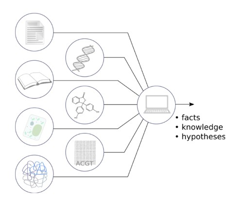

# Software manual for Knowledge Exploration System DES-RV

Welcome to DES, the knowledge exploration system used as the basis for several knowledgebases:

- [DES tomato](http://www.cbrc.kaust.edu.sa/des_tomato) (2017)
- [DES mutation](http://www.cbrc.kaust.edu.sa/des-mutation) (2018)
- [DES redox](https://www.cbrc.kaust.edu.sa/des-rv) (2019)

This version of the documentation is tailored to DES redox, and
not all features described are present in earlier versions.
To see the documentation for earlier version, change the version
in the bottom right corner.

The knowledge exploration system consists of information
organized in a way that allows easy information retrieval and
interpretation in order to get knowledge and to deduce new facts
(Figure 1).

DES knowledgebases are integrated resource thats consists of
a collection of relevant scientific literature and data
from various bioinformatics sources, with an engine that can reason
about this data and use built-in logic to derive new facts and suggest
hypotheses.

